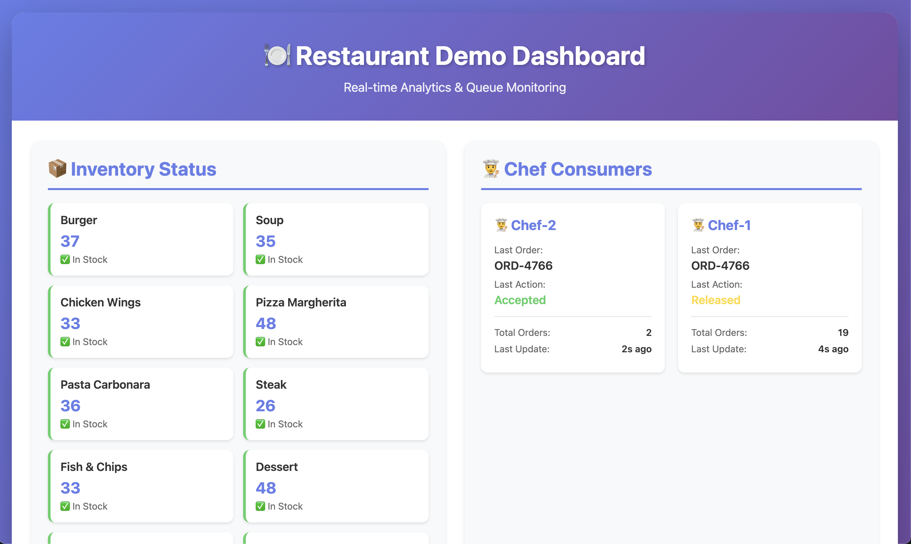
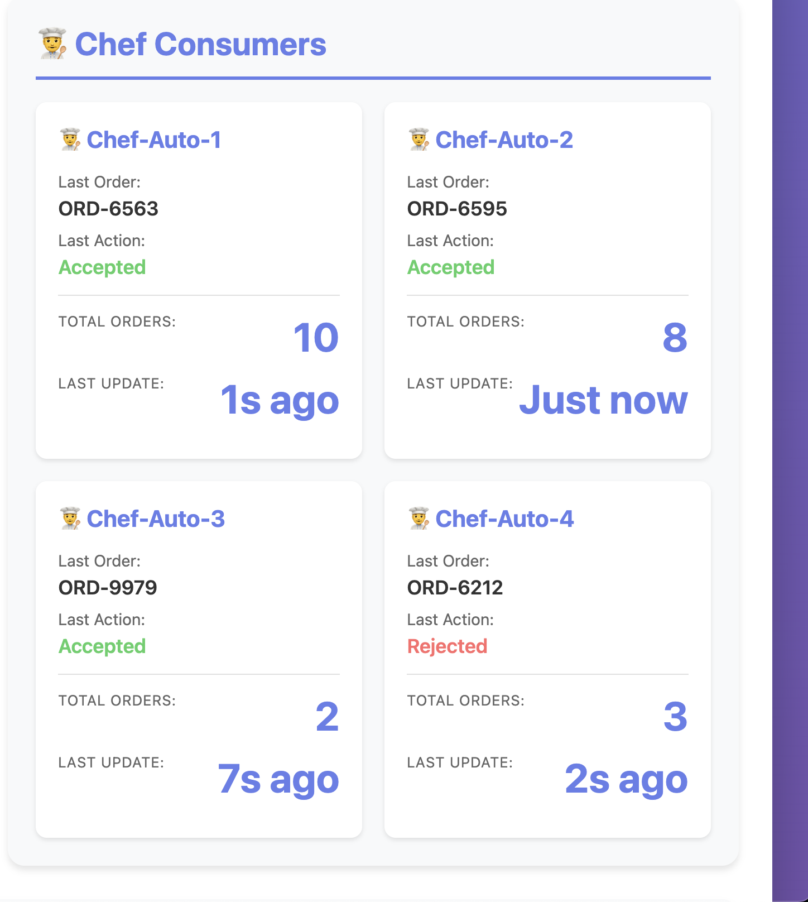

# Queues for Kafka Demo

[Queues for Kafka](https://cwiki.apache.org/confluence/display/KAFKA/KIP-932%3A+Queues+for+Kafka) (KIP-932) brings true queue semantics to Apache Kafka through **share groups**. Unlike traditional consumer groups where each partition is exclusively assigned to one consumer, share groups allow multiple consumers to process messages from the same partition concurrently, while Kafka still ensures each message is delivered to exactly one consumer at a time.

This demo (based on [ifnesi's original](https://github.com/ifnesi/queues-for-kafka)) turns that into a restaurant kitchen:

- **Waiters** (producers) submit orders to a Kafka topic
- **Chefs** (share group consumers) each grab orders off the queue
- An **inventory tracker** (standard consumer) watches all orders flow through
- A **dashboard** ties it all together with live scaling based on queue depth




## Prerequisites

- [Java 17+](https://www.oracle.com/java/technologies/javase/jdk17-archive-downloads.html)
- [Maven](https://maven.apache.org/install.html)
- [Terraform](https://developer.hashicorp.com/terraform/install) (for Confluent Cloud deployment)

**Mac (Homebrew):**

```bash
brew install openjdk@17 maven terraform
```


## Getting Started

There are two ways to run this demo. The standard version quickly shows the capabilities of Queues for Kafka with a custom autoscaler. The Kubernetes Event-driven Autoscaling (KEDA) version uses Kubernetes for scaling, using Prometheus to publish metrics near-real-time from the Kafka Admin API. This version simulates a production environment and requires some additional configuration. 

To run the standard version, continue in this README. To run the KEDA version, jump to the [KEDA Autoscaling README](keda-scaler/README.md).

### 1. Deploy a Confluent Cloud cluster

You need a Kafka cluster with Queues for Kafka enabled. The included Terraform creates a Dedicated cluster with a public endpoint and the API keys you'll use to connect.

First, create a **Cloud resource management API key** in Confluent Cloud.

1. Go to https://confluent.cloud/settings/api-keys
2. Click **Add API key**, select **Cloud resource management**
3. Save the key and secret

Then run Terraform:

```bash
cd terraform
terraform init
terraform apply
```

You'll be prompted for the key and secret you just created. Provisioning the Dedicated cluster can take some time. The topic you'll use, `orders-topic`, is created as part of the Terraform deployment as well. Once the provisioning finishes, load the connection details into your shell:

```bash
eval "$(terraform output -raw demo_env)"
```

This exports `BOOTSTRAP_SERVERS`, `CONFLUENT_API_KEY`, and `CONFLUENT_API_SECRET` so the demo apps can connect.

```bash
cd ..
```

<details>
<summary><strong>Alternative: Local Kafka with Docker</strong></summary>

No Confluent Cloud account? You can run against a local broker instead (some QfK features are Confluent Cloud-only).

```bash
docker run --name kafka_qfk --rm -p 9092:9092 apache/kafka:4.2.0
```

In a new terminal, enable share groups and create the topic:

```bash
docker exec -it kafka_qfk sh -c "
  /opt/kafka/bin/kafka-features.sh --bootstrap-server localhost:9092 upgrade --feature share.version=1 &&
  /opt/kafka/bin/kafka-topics.sh --bootstrap-server localhost:9092 --create --topic orders-queue --partitions 1
"
```

No environment variables needed — the demo defaults to `localhost:9092`.

</details>

### 2. Compile the project

```bash
mvn clean compile
```

### 3. Start the Dashboard

```bash
mvn exec:java -Dexec.mainClass=com.example.qtest.DashboardServer
```

Open http://localhost:8080 and you'll see an empty kitchen, no orders yet.

### 4. Start the Producer

On the dashboard, click the "Generate 40 Orders" button. The producer fires off 40 orders immediately to flood the kitchen, then keeps a steady stream going. Now, on the dashboard, you'll see chefs spin up to handle the backlog, then scale back down as the queue drains.


## What to Look For

### Accept, Release, Reject

Share groups give consumers four ways to handle a message, which is new for Kafka:

| Action | What Happens |
|--------|--------------|
| **Accept** | Done — message is acknowledged and leaves the queue |
| **Release** | Put it back — another consumer will pick it up |
| **Reject** | Discard it (bad data, unprocessable, etc.) |
| **Renew** | Extend the time allowed for processing the message |



### Auto-Scaling

The dashboard watches queue depth and spins chefs up or down automatically. When the producer sends that initial burst of 40 orders, you'll see chefs appear to handle the spike, then disappear as things calm down.

### Multiple Consumers, One Partition

In traditional Kafka, one partition means one consumer per group. Share groups break that rule by allowing multiple consumers in a single group. The topic in this demo runs with a single partition, but scales to as many chefs as needed.

### Queuing and Streaming Side by Side

The demo runs both patterns on the same topic at the same time:

- A **share group** (`chefs-share-group`) for queue-style processing — each order goes to one chef
- A **standard consumer group** (`inventory-analytics-group`) for streaming — the inventory system sees every order


## Teardown

Tear down the Confluent Cloud resources when you're done to stop billing:

```bash
cd terraform
terraform destroy
```

If you used local Docker instead:

```bash
docker stop kafka_qfk
```


## Learn More

- [KIP-932: Queues for Kafka](https://cwiki.apache.org/confluence/display/KAFKA/KIP-932%3A+Queues+for+Kafka)
- [Confluent Developer Portal](https://developer.confluent.io)
